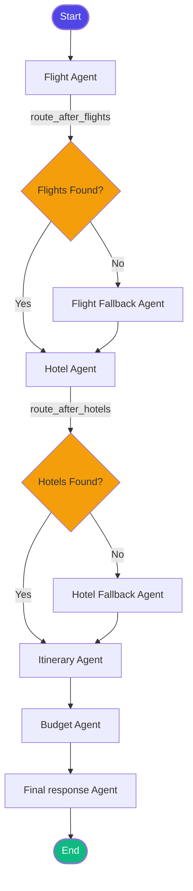

# 🌍 AI Multi-Agent Travel Planning System

A state-of-the-art travel planning platform utilizing a multi-agent workflow orchestrated with **LangGraph**, powered by **Groq (Llama 3.3 70B)**, and featuring a real-time streaming **FastAPI** backend, persistent **PostgreSQL** storage, and a premium **React + Tailwind CSS** frontend.

---

## 🚀 Key Features

*   **Orchestrated Multi-Agent Workflow:** Powered by LangGraph to route queries through specialized agents sequentially or dynamically based on data availability.
*   **Real-time Agent Streaming:** Implements Server-Sent Events (SSE) to update the frontend step-by-step as each agent finishes its execution.
*   **Persistent Session Memory:** Configured with a `PostgresSaver` checkpointer, allowing users to save, retrieve, and delete past trip plans from a local or hosted PostgreSQL database.
*   **Automatic Fallback Routing:** Intelligent conditional edges redirect to fallback nodes if flight or hotel search APIs fail or return empty results.
*   **Natural Language Budget Parsing:** Extracts budgets automatically from user requests (e.g. *"trip under 2 lakhs"*, *"₹50k budget"*) and interprets the estimated costs versus the limit.

---

## 📐 System Architecture

The following diagram illustrates how user requests flow through the multi-agent graph:



---

## 📁 Repository Structure

```
├── backend/
│   ├── main.py            # LangGraph agent definitions, routing, and DB checkpointer
│   ├── api.py             # FastAPI Server, SSE stream endpoint, and DB history endpoints
│   ├── requirements.txt   # Python dependencies
│   └── tools/             # Search and parsing tools (Flight, Budget, Tavily)
├── frontend/
│   ├── src/               # React (Vite) application source code
│   │   ├── components/    # ResultCard, SearchBar, TripHistory, LoadingState
│   │   └── App.jsx        # Main application dashboard and state management
│   ├── package.json       # Node.js dependencies
│   └── vite.config.js     # Frontend bundler configuration
└── .gitignore             # Configured git ignore for both environments
```

---

## 🛠️ Tech Stack

*   **Backend:** Python, LangGraph, FastAPI, LangChain, PostgreSQL, Groq (Llama 3.3 70B)
*   **Frontend:** React (Vite), Tailwind CSS (v4), HTML5, JavaScript
*   **Database:** PostgreSQL (with `psycopg` connection pooling)
*   **APIs & Search:** Tavily Search API, custom Flights & Budget tools

---

## ⚙️ Setup & Installation

### 1. Prerequisites
Make sure you have the following installed:
*   [Python 3.10+](https://www.python.org/downloads/)
*   [Node.js 18+](https://nodejs.org/)
*   [PostgreSQL Database](https://www.postgresql.org/)

### 2. Environment Variables Configuration
Create a `.env` file in the **root** folder and in the **backend** directory:

```env
GROQ_API_KEY=your_groq_api_key
TAVILY_API_KEY=your_tavily_search_api_key
DATABASE_URL=postgresql://<username>:<password>@localhost:5432/<database_name>
```

### 3. Backend Setup
1. Navigate to the backend directory and set up a virtual environment:
   ```bash
   cd backend
   python -m venv venv
   source venv/Scripts/activate  # On Windows: venv\Scripts\activate
   ```
2. Install the dependencies:
   ```bash
   pip install -r requirements.txt
   ```
3. Run the FastAPI development server:
   ```bash
   python api.py
   ```
   *The backend will run on `http://127.0.0.1:8000`.*

### 4. Frontend Setup
1. Navigate to the frontend directory:
   ```bash
   cd ../frontend
   ```
2. Install the npm packages:
   ```bash
   npm install
   ```
3. Run the Vite development server:
   ```bash
   npm run dev
   ```
   *The frontend application will run on `http://localhost:5173`.*

---

## 🤖 Agents & Tools Explained

### Agent Network
1.  **Flight Agent:** Extracts departure/destination and dates to query the Flight Tool.
2.  **Hotel Agent:** Uses the Tavily search tool to retrieve top-rated hotels, average pricing, and traveler ratings.
3.  **Itinerary Agent:** Takes the output from flights/hotels and crafts a personalized day-by-day plan.
4.  **Budget Agent:** Computes flight + hotel costs, compares it to the parsed user budget, and provides recommendations (under budget upgrade tips / over budget saving suggestions).
5.  **Final Response Agent:** Integrates the components into a polished Markdown layout.

### Custom Tools
*   **Flight Search Tool (`flight_tool.py`):** Simulates flight schedule and pricing queries.
*   **Tavily Search Tool (`tavily_tool.py`):** Interfaces with the Tavily Search API to execute targeted accommodation searches.
*   **Budget Calculator (`budget_tool.py`):** Heavy-lifting parser that extracts numeric values and performs math operations on travel costs.
